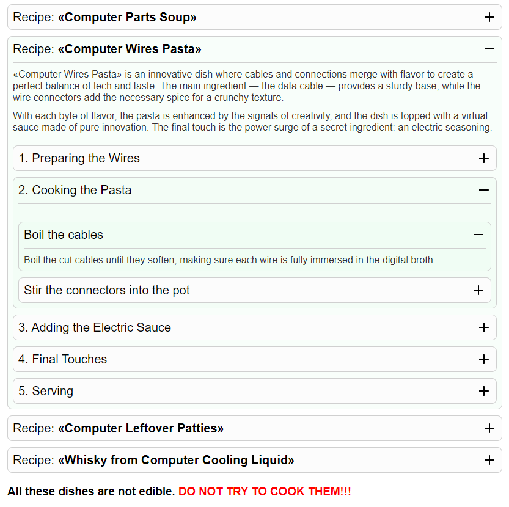
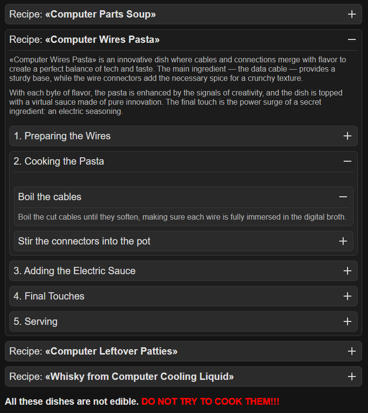
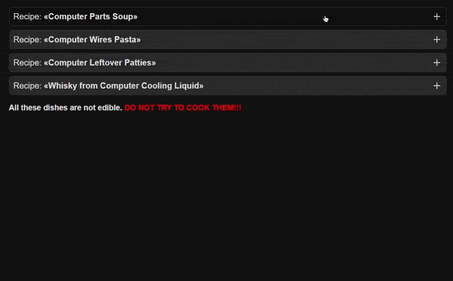

# Kordion (Deprecated)

<h3>It is no longer supported soon. I recommend using the new package <a href="https://github.com/koirodev/prismapps" target="_blank">@koirodev/prismapps</a>. It contains Kordion and other packages.</h3>

**Kordion** is a library for quickly creating flexible accordions on a page using JavaScript. It allows you to create accordions with various settings and styles, as well as control them using JavaScript. <strong>Kordion uses vanilla JavaScript</strong> and does not depend on third-party libraries, which makes it lightweight and fast.

[](https://www.npmjs.com/package/kordion)
[](https://www.npmjs.com/package/kordion)

## 📋 Table of Contents

- [Getting Started with Kordion](#getting-started-with-kordion)
  - [Installation](#installation)
    - [Install from NPM](#install-from-npm)
    - [Use Kordion from CDN](#use-kordion-from-cdn)
    - [Download](#download)
  - [Kordion HTML Layout](#kordion-html-layout)
  - [Initialize Kordion](#initialize-kordion)
- [Parameters](#parameters)
- [Events](#events)
- [Methods](#methods)
- [Themes](#themes)
  - [`clear`](#clear)
  - [`default`](#default)
  - [`dark`](#dark)
- [Effects](#effects)
  - [`Line-By-Line`](#line-by-line)
- [Plugin for `Vue.js`](#plugin-for-vuejs)
  - [Kordion props](#kordion-props)
  - [Kordion events](#kordion-events)
  - [KordionCurrent props](#kordioncurrent-props)
  - [KordionIcon props](#kordionicon-props)
- [Examples](#examples)
- [FAQ](#faq)

## Getting started with Kordion

### Installation

You have several possible options for installing the Kordion:

### Install from NPM

```bash
$ npm install kordion
```

```JavaScript
// Import Kordion JS
import Kordion from "kordion";

// Import Kordion styles
import "kordion/css";
// Import Kordion theme
import "kordion/theme/default";

const kordion = new Kordion(...);
```

### Use Kordion from CDN

If you don't want to include Kordion files in your project, you may use it from CDN:

```HTML
<!-- Default styles -->
<link rel="stylesheet" href="https://cdn.jsdelivr.net/npm/kordion/dist/kordion.min.css">
<!-- Theme -->
<link rel="stylesheet" href="https://cdn.jsdelivr.net/npm/kordion/dist/themes/default.min.css">

<!-- Script -->
<script src="https://cdn.jsdelivr.net/npm/kordion/dist/kordion.min.js"></script>
```

If you use ES modules in your browser, there is a CDN version for that:

```HTML
<script type="module">
  import Kordion from "https://cdn.jsdelivr.net/npm/kordion/dist/kordion.min.mjs"

  const kordion = new Kordion(...)
</script>
```

### Download

If you want to use Kordion locally, you can directly download them from: [jsdelivr.com](https://www.jsdelivr.com/package/npm/kordion).

## Kordion HTML Layout

Now, we need to add basic Kordion layout:

```HTML
<!-- The accordion itself -->
<div data-kordion>
  <!-- Accordion Open Button -->
  <button data-kordion-current>
    <span>I am a button!</span>
    <!-- Button icon -->
    <svg data-kordion-icon="[plus, minus]">
      <use xlink:href="sprite.svg#plus"></use>
    </svg>
  </button>
  <!-- Technical wrapping of content -->
  <div data-kordion-hidden>
    <!-- Main content wrapper -->
    <div data-kordion-content>
      <!-- Any of your content can be here, for example: -->
      <article class="article">
        <h2>Lorem ipsum, dolor sit amet consectetur adipisicing elit.</h2>
        <p>
          Lorem ipsum dolor sit amet consectetur adipisicing elit. Impedit dolorem optio quaerat assumenda cupiditate quasi incidunt totam expedita voluptatem. Tenetur, dolorum quisquam alias sit asperiores dolorem atque cupiditate numquam magnam?
        </p>
      </article>
    </div>
  </div>
</div>
```

## Initialize Kordion

Next we need to initialize Kordion in JavaScript:

```JavaScript
const kordion = new Kordion("[data-kordion]");
```

It's that easy to start working with the accordion. You can also customize its functionality more flexibly.

```JavaScript
const kordion = new Kordion("[data-kordion]", {
  // Options
  speed: 350,
  spritePath: "sprite.svg",
  autoClose: false,
  autoCloseNested: false,
  scrollTo: false,
});
```

These are not all the settings, below you can read about each of them in more detail or see examples of implementation.

### Parameters

<table>
  <thead>
    <tr>
      <th>Option</th>
      <th>Type</th>
      <th>Default</th>
      <th>Description</th>
    </tr>
  </thead>
  <tbody>
    <tr>
      <td><code>speed</code></td>
      <td>Number</td>
      <td><code>350</code></td>
      <td>The speed of the animation when opening and closing the accordion.</td>
    </tr>
    <tr>
      <td><code>theme</code></td>
      <td>String</td>
      <td><code>"clear"</code></td>
      <td>Theme setup. Requires connection of styles of the selected theme.<br><b>By default, kordion does not use themes.<b><br></td>
    </tr>
    <tr>
      <td><code>autoClose</code></td>
      <td>Boolean</td>
      <td><code>false</code></td>
      <td>Automatically close accordions in one container when opening a new accordion. To do this, you must additionally add a container selector to the markup.</td>
    </tr>
    <tr>
      <td><code>autoCloseNested</code></td>
      <td>Boolean</td>
      <td><code>false</code></td>
      <td>Automatically close child accordions when opening a second child accordion in one parent accordion.</td>
    </tr>
    <tr>
      <td><code>spritePath</code></td>
      <td>String</td>
      <td><code>"sprite.svg"</code></td>
      <td>Path to sprite with icons, for automatic icon replacement when opening and closing accordion.</td>
    </tr>
    <tr>
      <td><code>getKordionHeight</code></td>
      <td>Boolean</td>
      <td><code>false</code></td>
      <td>When set to true, it will use the height of the accordion, not the content inside.</td>
    </tr>
    <tr>
      <td><code>container</code></td>
      <td>Object</td>
      <td><code>["[data-kordion-container]", ".section"]</code></td>
      <td>Container selectors, multiple selectors allowed. <br>Used when <code>autoClose: true</code>.</td>
    </tr>
    <tr>
      <td><code>parent</code></td>
      <td>String</td>
      <td><code>"[kordion-parent]"</code></td>
      <td>Added automatically to the parent accordion. Does not require prior specification in HTML markup. <br><b>Only data attribute is allowed.</b></td>
    </tr>
    <tr>
      <td><code>current</code></td>
      <td>String</td>
      <td><code>"[data-kordion-current]"</code></td>
      <td>Accordion opening button selector. Any type of selector is allowed.</td>
    </tr>
    <tr>
      <td><code>icon</code></td>
      <td>String</td>
      <td><code>"[data-kordion-icon]"</code></td>
      <td>Button icon selector. <br><b>Only data attribute is allowed.</b> <br>Accepts two icon names via <code>,</code>. <br>Example: <code>data-kordion-icon="[plus, minus]"</code> or <code>data-kordion-icon="plus, minus"</code>. <br>Works only with sprites.</td>
    </tr>
    <tr>
      <td><code>hidden</code></td>
      <td>String</td>
      <td><code>"[data-kordion-hidden]"</code></td>
      <td>Technical content wrapper selector. <br>Any type of selector can be used.</td>
    </tr>
    <tr>
      <td><code>content</code></td>
      <td>String</td>
      <td><code>"[data-kordion-content]"</code></td>
      <td>Primary content selector. <br>Any type of selector can be used.</td>
    </tr>
    <tr>
      <td><code>activeClass</code></td>
      <td>String</td>
      <td><code>"js-kordion-active"</code></td>
      <td>Active accordion class. Set on accordion after opening animation starts and removed when closing animation starts.</td>
    </tr>
    <tr>
      <td><code>openedClass</code></td>
      <td>String</td>
      <td><code>"js-kordion-opened"</code></td>
      <td>Class for a fully expanded accordion. Set to <code>hidden</code> after the opening animation ends, and unset when the closing animation starts.</td>
    </tr>
    <tr>
      <td><code>disabledClass</code></td>
      <td>String</td>
      <td><code>"js-kordion-disabled"</code></td>
      <td>Class for disabling interaction with accordion content when it is opened or closed. Set automatically to <code>content</code></td>
    </tr>
    <tr>
      <td><code>effect</code></td>
      <td>String</td>
      <td></td>
      <td>Register the animation of opening and closing the accordion. Currently there is only <code>line-by-line</code> animation.</td>
    </tr>
    <tr>
      <td><code>effectLineByLine</code></td>
      <td>Object</td>
      <td></td>
      <td>An object with <code>line-by-line</code> animation parameters.
<pre><code>
const kordion = new Kordion("[data-kordion]", {
  theme: "dark",
  effect: "line-by-line",
  effectLineByLine: {
    speed: 500,
    delay: 20,
    y: 50
  },
});
</code></pre></td>
    </tr>
    <tr>
      <td><code>events</code></td>
      <td>Object</td>
      <td></td>
      <td>Register event handlers</td>
    </tr>
  </tbody>
</table>

### Events

You can register event handlers for the basic accordion actions. Example:

```JavaScript
const kordion = new Kordion("[data-kordion]", {
  events: {
    on: {
      init: function (kordion) {
        console.log("kordion initialized");
      },
    },
    before: {
      init: function (kordion) {
        console.log("Accordion initialized");
      },
      hide: function (kordion, instance) {
        console.log("The accordion is fully open");
      },
    },
  }
});

kordion.on("show", (kordion, instance) => {
  console.log("Accordion opening");
});

kordion.on("beforeShow", (kordion, instance) => {
  console.log("Accordion opening");
});
```

The following events are available:

<table>
  <thead>
    <tr>
      <th>Group</th>
      <th>Name</th>
      <th>Arguments</th>
      <th>Description</th>
    </tr>
  </thead>
  <tbody>
    <tr>
      <td rowspan="4"><code>before</code></td>
    </tr>
    <tr>
      <td><code>init</code></td>
      <td><code>(kordion)</code></td>
      <td>Event before accordion initialization</td>
    </tr>
    <tr>
      <td><code>show</code></td>
      <td><code>(kordion, instance)</code></td>
      <td>Event before the opening of the accordion</td>
    </tr>
    <tr>
      <td><code>hide</code></td>
      <td><code>(kordion, instance)</code></td>
      <td>Event before accordion closing</td>
    </tr>
    <tr>
      <td rowspan="4"><code>on</code></td>
    </tr>
    <tr>
      <td><code>init</code></td>
      <td><code>(kordion)</code></td>
      <td>Event immediately after accordions are initialized</td>
    </tr>
    <tr>
      <td><code>show</code></td>
      <td><code>(kordion, instance)</code></td>
      <td>Event during the opening of the accordion</td>
    </tr>
    <tr>
      <td><code>hide</code></td>
      <td><code>(kordion, instance)</code></td>
      <td>Event during the closing of the accordion</td>
    </tr>
    <tr>
      <td rowspan="4"><code>after</code></td>
    </tr>
    <tr>
      <td><code>init</code></td>
      <td><code>(kordion)</code></td>
      <td>Event after accordion initialization</td>
    </tr>
    <tr>
      <td><code>show</code></td>
      <td><code>(kordion, instance)</code></td>
      <td>Event after the opening of the accordion</td>
    </tr>
    <tr>
      <td><code>hide</code></td>
      <td><code>(kordion, instance)</code></td>
      <td>Event after accordion closing</td>
    </tr>
  </tbody>
</table>


### Methods

After initializing Kordion, you have an initialized instance of it in a variable (like the kordion variable in the example above) with useful methods and properties.

Example:

```JavaScript
const kordion = new Kordion("[data-kordion]");

// Open all accordions by clicking on `".show-all-in-container"`
// in the container with the class `.container`
const button = document.querySelector(".show-all-in-container")
button.addEventListener("click", () => {
  kordion.showAll(".container");
});
```

<table>
  <thead>
    <tr>
      <th>Method</th>
      <th>Description</th>
    </tr>
  </thead>
  <tbody>
    <tr>
      <td><code>kordion.createInstance(element)</code></td>
      <td>Creates an accordion instance. Returns an accordion instance.</td>
    </tr>
    <tr>
      <td><code>kordion.toggle(instance)</code></td>
      <td>Toggle accordion. Accepts an accordion instance.</td>
    </tr>
    <tr>
      <td><code>kordion.show(instance)</code></td>
      <td>Accordion Opening Method.</td>
    </tr>
    <tr>
      <td><code>kordion.showAll(container)</code></td>
      <td>Method for opening all accordions in the specified container. Accepts a selector or DOM element of the container in which to search.</td>
    </tr>
    <tr>
      <td><code>kordion.showEverything()</code></td>
      <td>Method to open all accordions on a page.</td>
    </tr>
    <tr>
      <td><code>kordion.hide(instance)</code></td>
      <td>Accordion closing method.</td>
    </tr>
    <tr>
      <td><code>kordion.hideNested(instance)</code></td>
      <td>Method for closing child accordions.</td>
    </tr>
    <tr>
      <td><code>kordion.hideAll(container)</code></td>
      <td>Method for closing all accordions in the specified container. Accepts a selector or DOM element of the container in which to search.</td>
    </tr>
    <tr>
      <td><code>kordion.hideEverything(thisSelector)</code></td>
      <td>Method to close all accordions on a page. <code>thisSelector</code> takes a Boolean value, if <code>true</code>, it will be called only for the accordions from which the call occurs, if <code>false</code>, then for ALL accordions on the page, without reference to the accordion from which the call occurs. Default: <code>true</code></td>
    </tr>
    <tr>
      <td><code>kordion.off(eventName, handler)</code></td>
      <td>Remove event handler</td>
    </tr>
    <tr>
      <td><code>kordion.offAny(handler)</code></td>
      <td>Remove event listener that will be fired on all events</td>
    </tr>
    <tr>
      <td><code>kordion.on(eventName, handler)</code></td>
      <td>Add event handler</td>
    </tr>
    <tr>
      <td><code>kordion.replaceIcon(instance, hidden = true)</code></td>
      <td>Method for replacing an icon. Accepts an accordion instance and a boolean icon value:<br>
      <code>true</code> = open accordion icon;
      <br>
      <code>false</code> = closed accordion icon.</td>
    </tr>
  </tbody>
</table>

## Themes

### `clear`

This is a standard theme, for which it is enough to connect only standard styles. It contains only the most necessary styles for the accordion to work.

### `Default`

Standard Kordion theme made with love for users.

- <a href="https://codepen.io/koirodev/pen/BaXMXLZ" target="_blank">Codepen</a>
- <a href="//koirodev.github.io/kordion/demos/01-default.html" target="_blank">Example page</a>

<details>
  <summary>View screenshot</summary>
  
</details>

### `Dark`

Dark theme for connoisseurs of greatness.

- <a href="https://codepen.io/koirodev/pen/ExqMYVK" target="_blank">Codepen</a>
- <a href="//koirodev.github.io/kordion/demos/02-default-dark.html" target="_blank">Example page</a>

<details>
  <summary>View screenshot</summary>
  
</details>

## Effects

### `Line-By-Line`

Line-by-line appearance of accordion content.

<details>
  <summary>Preview GIF</summary>
  
</details>

```JavaScript
import Kordion from "kordion";

const kordion = new Kordion("[data-kordion]", {
  theme: "dark",
  effect: "line-by-line",
  effectLineByLine: {
    speed: 350,
    easing: "ease",
    delay: 20,
    y: 50,
  },
});
```

<table>
  <thead>
    <tr>
      <th>Option</th>
      <th>Type</th>
      <th>Default</th>
      <th>Description</th>
    </tr>
  </thead>
  <tbody>
    <tr>
      <td><code>speed</code></td>
      <td>Number</td>
      <td><code>350</code></td>
      <td>Animation speed</td>
    </tr>
    <tr>
      <td><code>easing</code></td>
      <td>String</td>
      <td><code>"cubic-bezier(.25,.1,.25,1)"</code></td>
      <td>Animation timing function</td>
    </tr>
    <tr>
      <td><code>delay</code></td>
      <td>Number</td>
      <td><code>30</code></td>
      <td>Delay from previous to next element.</td>
    </tr>
    <tr>
      <td><code>scale</code></td>
      <td>Number</td>
      <td><code>0.95</code></td>
      <td>The scale value from which the animation will start.</td>
    </tr>
    <tr>
      <td><code>y</code></td>
      <td>Number/String</td>
      <td><code>20</code></td>
      <td>The offset along the Y axis from which the animation will start.</td>
    </tr>
    <tr>
      <td><code>x</code></td>
      <td>Number/String</td>
      <td><code>0</code></td>
      <td>The offset along the X axis from which the animation will start.</td>
    </tr>
    <tr>
      <td><code>opacity</code></td>
      <td>Number/String</td>
      <td><code>0.6</code></td>
      <td>The opacity value at which the animation will start.</td>
    </tr>
    <tr>
      <td><code>clearProps</code></td>
      <td>Object</td>
      <td><code>["transform", "opacity", "transition"]</code></td>
      <td>Clearing props. Specifies which props will be cleared at the end of the animation. It is acceptable to enter a string or boolean values.</td>
    </tr>
  </tbody>
</table>

## Plugin for `Vue.js`

Установка:

```bash
$ npm install kordion
```

Использование:

```HTML
<script setup>
import { Kordion, KordionCurrent, KordionContent, KordionIcon } from 'kordion/vue'
import 'kordion/css'
import 'kordion/theme/dark'

const kordionOptions = {
  speed: 500,
  theme: 'dark',
}
</script>

<template>
  <div data-kordion-container> <!-- Not obligatory. Required for automatic closing to work. -->
    <Kordion 
      :options="kordionOptions"
      @show="console.log('show')"
      @hide="console.log('hide')"
      @before-show="console.log('before-show')"
      @before-hide="console.log('before-hide')"
      @after-show="console.log('after-show')"
      @after-hide="console.log('after-hide')"
    >
      <KordionCurrent selector="button" :attributes="{ type: 'button', title: 'open' }">
        <span>Open</span>
        <KordionIcon value="sprite.svg#plus" icons="plus, minus" /> <!-- It is optional -->
      </KordionCurrent>
      <KordionContent>
        <p>Content</p>
        <p>Content</p>
        <p>Content</p>
        <p>Content</p>
      </KordionContent>
    </Kordion>
  </div>
</template>
```

### Kordion props

<table>
  <thead>
    <tr>
      <th>Prop</th>
      <th>Type</th>
      <th>Default</th>
      <th>Required</th>
      <th>Description</th>
    </tr>
  </thead>
  <tbody>
    <tr>
      <td><code>options</code></td>
      <td>Object</td>
      <td><code>{}</code></td>
      <td><code>false</code></td>
      <td>The same parameters are passed as in core. It is forbidden to transmit events.</td>
    </tr>
  </tbody>
</table>


### Kordion events
The Kordion component supports all Kordion events except initialization events. For example:

```HTML
<Kordion @before-show="..." @before-hide="..." @after-hide="...">
```


### KordionCurrent props

<table>
  <thead>
    <tr>
      <th>Prop</th>
      <th>Type</th>
      <th>Default</th>
      <th>Required</th>
      <th>Description</th>
    </tr>
  </thead>
  <tbody>
    <tr>
      <td><code>selector</code></td>
      <td>String</td>
      <td><code>"button"</code></td>
      <td><code>false</code></td>
      <td>HTML button selector. It is allowed to pass any existing HTML selector.</td>
    </tr>
    <tr>
      <td><code>attributes</code></td>
      <td>Object</td>
      <td><code>{}</code></td>
      <td><code>false</code></td>
      <td>The attributes of the button. For example: <code>type: "button"</code>. It is allowed to transfer date attributes, etc.</td>
    </tr>
  </tbody>
</table>


### KordionIcon props

<table>
  <thead>
    <tr>
      <th>Prop</th>
      <th>Type</th>
      <th>Default</th>
      <th>Required</th>
      <th>Description</th>
    </tr>
  </thead>
  <tbody>
    <tr>
      <td><code>value</code></td>
      <td>String</td>
      <td><code>"sprite.svg#icon"</code></td>
      <td><code>false</code></td>
      <td>The initial value of the icon</td>
    </tr>
    <tr>
      <td><code>icons</code></td>
      <td>String</td>
      <td></td>
      <td><code>true</code></td>
      <td>Two icons separated by a comma. For example: <code>"plus, minus"</code></td>
    </tr>
  </tbody>
</table>

## Examples

You can see more detailed examples <a href="//koirodev.github.io/kordion/demos/" target="_blank">by following the link</a>.

## FAQ

### How to build ready files?

It's very simple. Make sure you are in the root of the repository and enter the commands in your terminal:

```bash
$ npm install
$ npm run build
```

Done. The collected files are in the `./dist` directory.
